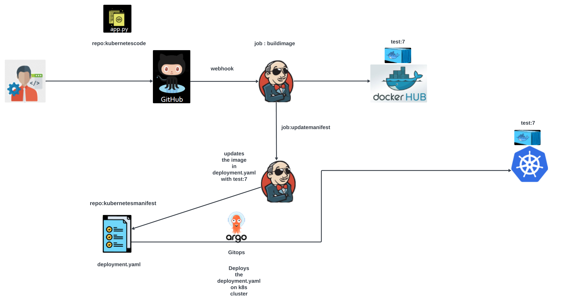

This repo along with https://github.com/kwdutta88/kuberenetesmanifest.git creates a Jenkins pipeline with GitOps to deploy code into a Kubernetes cluster.The CI part is done via Jenkins and CD part via ArgoCD (GitOps).

